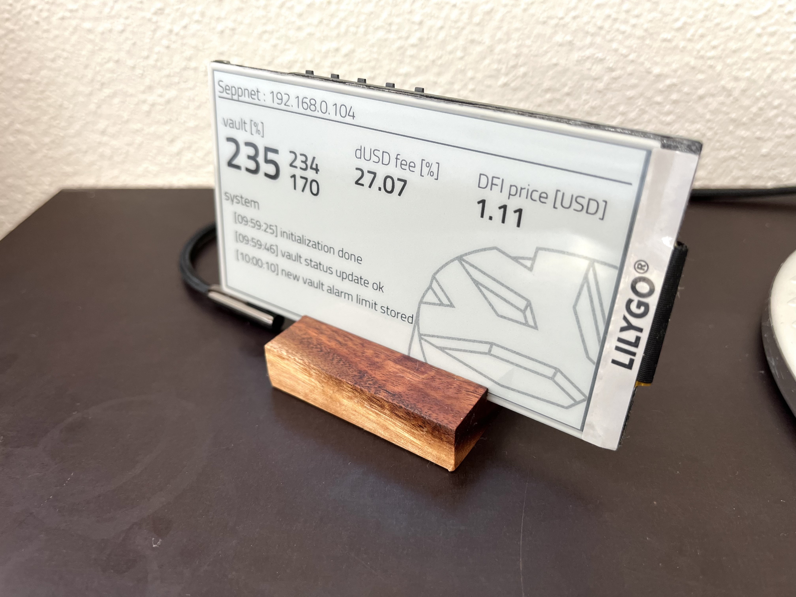
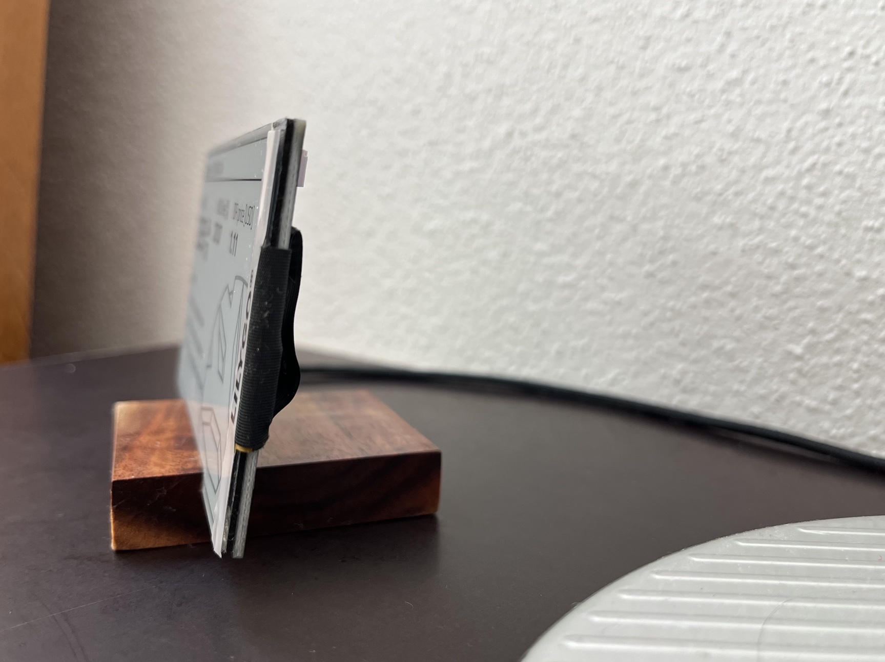
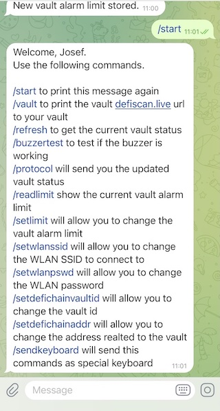
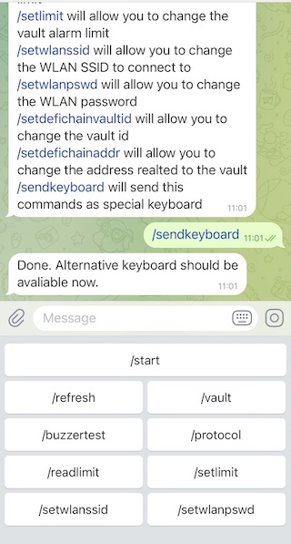

# DeFiChainVaultAlarm
Checks your vault status and generates an alarm when it falls below a defined threshold.

Shows current vault ratio (big number in block of three numbers)
Next vault ratio (top right in block of three numbers)
Vault limit ratio (bottom right in block of three numbers)

The DeFiChainVaultAlarm is configurable over telegram

## Prepare Arduino IDE

### Download and install Arduino IDE
[download](https://www.arduino.cc/en/software)

### Install ESP32 board
Arduinon -> Tools -> Board -> Board Manager -> esp32 (v 2.0.3 was used)

### Install UniversalTelegramBot
Arduino -> Tools -> Manage Libraries -> UniversalTelegramBot (v 1.3.0 was used)

### Install Arduino JSON
Arduino -> Tools -> Manage Libraries -> ArduinoJson (v 6.18.0 was used)
2
### Install Analog Write
Arduino -> Tools -> Manage Libraries -> ESP32 AnalogWrite (v 0.1.0 was used)

### Install LiliGo library
Download zip from https://github.com/Xinyuan-LilyGO/LilyGo-EPD47
-> https://github.com/Xinyuan-LilyGO/LilyGo-EPD47/archive/refs/heads/master.zip
Install it:
Arduino -> Sketch -> Include Library -> Add .ZIP Library -> select downlod from LiliGo library

## Configure Code
Open DefiChainAlarm_cfg.h file in Arduino

### Wifi connection
Add your wifi credentials in DEFAULT_WLAN_SSID and DEFAULT_WLAN_PASSWORD

### DeFiChain Vault
Add your defichain address in DEFAULT_DEFICHAIN_ADDR
and your vault address in DEFAULT_DEFICHAIN_VAULT

### Telegram bot
- search for the user "botfather" in your telegram client
- send him the message "/start"
- send "/newbot" to create a new bot
- follow the instructions in order to create the bot and get the bot token
- add the bot token to BOTtoken in your DefiChainAlarm_cfg.h file

### Telegram user ID
It may make sense to add your user ID to the ino file. 
- search for the user "IDBot" in your telegram client
- send "/getid"
- add your user ID to CHAT_ID in your DefiChainAlarm_cfg.h file

## Bugfixes

### Java2 vs. Java3
In case you get a compile error like this "exec: "python": executable file not found in $PATH" then follow the instructions from here:
https://georgik.rocks/esp32-arduino-macos-exec-python-executable-file-not-found-in-path/
Note: Your Arduino15 folder can be located somewhere else. Please check the preferences of your Arduino installation.

## Hardware

### ESP32 Lilygo
You will need this hardware:
[The Lilygo ESP32 e-Paper display (PH 2.0 variant)](https://de.aliexpress.com/item/1005002006058892.html?spm=a2g0o.order_list.0.0.56495c5fTINk9D&gatewayAdapt=glo2deu) and 
[the cable connecting the buzzer](https://de.aliexpress.com/item/1005003912905288.html?spm=a2g0o.order_list.0.0.56495c5fTINk9D&gatewayAdapt=glo2deu)
A battery is not mandatory as the hw is powered over USB. But in case you want to use it (temporary) without a USB connection, you will need something like this:
[Battery (example)](https://de.aliexpress.com/item/1005002919536938.html?spm=a2g0o.productlist.0.0.74036fa6idQD2W&ad_pvid=202205021227217858146889041840000671022_1&s=p) 

### Buzzer
I bougth this one: [buzzer](https://www.amazon.de/gp/product/B07DPR4BTN/ref=ppx_yo_dt_b_asin_title_o00_s00?ie=UTF8&psc=1)

### Connect the Buzzer
In my example the buzzer GND pin is directly connected to the uC ground and the supply pin (+) is connected to D5 (see BUZZERPIN in DefiChainAlarm_cfg.h) of the uC board. Please adapt this for your hardware.

## Compile

- open the ino file
- make sure you selected the "ESP32 Dev Module" board in Skech > Tools > Board...
- set Skech > Tools > PSRAM to enabled
- connect the board to your computer
- select the new port in Sketch > Tools > Port...
- upload the file

